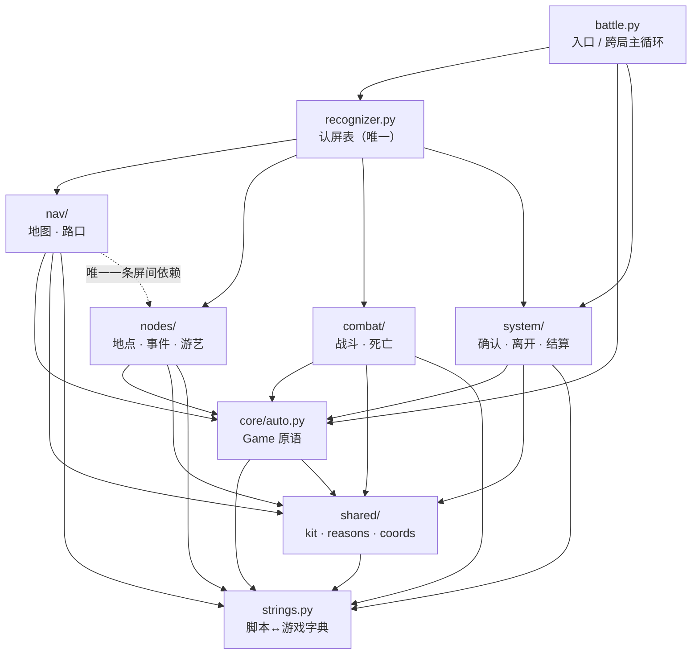
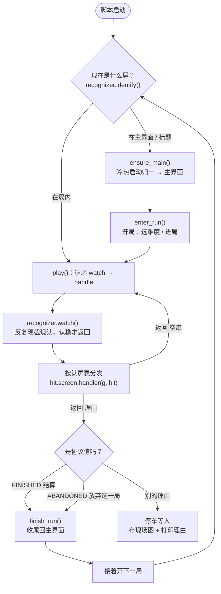

# 脚本架构与流程图

本文是 `script/` 的结构说明书。**目录怎么分、每层能依赖谁、一屏的 `handle()`
要守哪四条**，都在这。改动 `script/` 的结构前先读它。

> 本文的对应关系由两条门禁机器核：`tools/check_strings.py`（脚本 ↔ 管线那本字典）
> 与 `tools/check_screens.py`（本文第 2、3 节那些断言）。**CI 不跑这两条**，改完要手动跑。

---

## 1. 六个目录 + 四个根文件

```
script/
├── strings.py      「脚本 ↔ 游戏」字典 —— 脚本里不许出现游戏里的字，一律走它的常量
├── events.json     事件集（用户改事件策略的地方）
├── recognizer.py   **唯一**一张认屏表：每屏一行（判据 + handler + 顺序 note）
├── battle.py       入口 / 跨局主循环
│
├── core/    原语      auto.py —— Game 类（截图 / 识别 / 点击 / 等待 / 战斗 / 退局）
├── shared/  公共 API  kit.py（停车留证 park）  reasons.py（全部停车理由 + 两个协议值）
│                     coords.py（全部固化坐标，1280x720 基准）
├── nav/     自动寻路  map.py（读图 / 挑路 / 走一步）  map_view.py（地图屏）  fork.py（路口屏）
├── nodes/   节点处理  15 个地点模块 + 事件 4 行 + 游艺 6 行
├── combat/  自动战斗  fight.py（战斗屏）  death.py（死亡屏 / 化形信使屏）
└── system/  界面逻辑  confirm.py（确认弹窗屏）  leave.py（通用离开屏）  settlement.py（结算屏 + 收尾）
```

`shared/` 现在有三样东西，**都是实测出来的**：`park()` 收敛了 46 处
「存现场图 + 打印 + return 理由」三连；`reasons.py` 收了原先散在 16 个文件里的
55 处理由字面量；`coords.py` 收了原先散在 12 个文件里的**全部固化坐标**
（固定点击落点 + 像素窗口），一律按 **1280x720 基准**写 —— 靠框架的
`display_short_side: 720` 归一兑现 16:9 的全分辨率自适应，非 16:9 在 `Game.connect()`
会打一行警告（不来 Python 侧缩放，那会与框架叠加出两个坐标系）。反过来，
「离开地点之后清确认弹窗」与「点一下再确认」这两类
**看着像重复、其实是四五个语义各不相同的调用点**，没并（取舍记在
`shared/kit.py` 的 docstring 里）——「离开」那条做成了原语
`Game.leave_after()`，留在 `core/auto.py`。

认屏表是**唯一**的"谁是谁"——`nav/nodes/combat/system` 四个包是**叶子**，
谁都不许 import 别人；它们由 `recognizer.py` 按屏分发调用（`check_screens.py` 钉着）。

---

## 2. 依赖方向



**四个叶子包之间**默认零互相 import；唯一一条例外是 `nav/map_view.py` 用
`nav/map.py` 的读图结果（同属"寻路"这块）。屏与屏之间不许 import ——
谁 import 谁都会在将来某天变成环，环在 import 期就炸。

`core → shared` 那条边是 2026-10-04 才有的：`Game.fight()` 打到最后要交回
`FINISHED`，而那个值住在 `shared/reasons.py`。它是**单向**的 —— `shared/`
一个 import 都没有（`kit.park` 只用传进来的 `g`），所以不成环。原语层反过来
被 `shared` 依赖是不可能的：`park` 收的就是一个 `Game`。

---

## 3. 屏模块四条契约

`nav/nodes/combat/system` 里每个模块对应游戏里的一个界面，只暴露一个入口：

```python
handle(g, hit) -> str

""        处理完了 —— 继续跑下一轮。
"理由"    停下等人，理由原样报给用户（比如 "等待选路"）。
```

**没有 `None`**。"不是这屏"由 `recognizer.py` 的认屏表回答，屏模块没有资格说这句话 ——
从结构上消灭「认出来了却返回 `None`」那个坑（从前篝火就踩过：策略写好了却没接线，
通用「离开地点」分支抢先把它点掉了，看着一切正常）。

四条约定，**踩过坑才写在这儿的**：

1. **动手之前必须现读**。动作要用的一切（按钮在不在、数字是多少、选项有几行）都在
   handler 里**重新截一帧**再读：点按钮走 `g.click_when(...)`，读数字 / 文字**不传
   `image`**（= 现截一张）。`hit` 里的 `matched` / `evidence` 是**认屏那一刻的事实，
   只配进日志**，不许拿它决定"点什么"。
   过去三起事故（点空「坠入深境」、公告页被连点两下、篝火「三项都没认出来」）
   都是同一个病：拿认屏那一帧去动手，而那一帧已经过期了。
2. **点完等状态变化，不用 `time.sleep` 蒙**：用 `g.wait_gone(节点)` /
   `g.wait_for([...])`。sleep 掉的时长是猜的，猜短了就会对着退场动画再点一次。
3. **决策型的屏先等"准备度"，再读决策依据**。要在一屏上做选择（篝火点哪支、路口走哪条、
   护符装哪个）时，先等这一屏的按钮 / 面板**画出来**（`g.wait_for([...], timeout=...)`），
   **然后**才去读魂晶、读选项。
   反例：篝火界面认出来了、魂晶也读了，可选项面板还没画上来 ——「激活护符」一帧缺席，
   脚本就当"这支不可用"，那是**替用户改策略**。一帧缺席 ≠ 不可用；等够了再说不可用，
   而且要留痕（`g.snap(...)`）。
4. **判据要留痕**：认不准 / 点不到就把屏存一张（`g.snap("xxx")`）再停下，
   别默默空转，也别猜。

模块之间**不许互相 import**（各自只依赖 `core.auto` / `strings` / `nav.map`，以及
`shared` 的 `kit` / `reasons`），这条由 `tools/check_screens.py` 机器核。

---

## 4. 一局的流程



**协议值是脚本自己的词**，由 `battle.py` 分辨，不往上报给用户：

| 值 | 定义处 | 谁交回来 | 含义 |
|---|---|---|---|
| `FINISHED = "结算"` | `shared/reasons.py` | `core/auto.py` 的 `fight()` | 打到最后了，去收尾 |
| `ABANDONED = "放弃这一局"` | `shared/reasons.py` | `combat/fight.py`（战斗超时退局） | 战斗超时退的局，去收尾但不记胜负 |

两个值**并排住在 `shared/reasons.py`**（2026-10-04 之前一个在 `system/settlement.py`、
一个在 `combat/fight.py`）—— 它们是**成对**的、由 `battle.py` 一起分辨，分开住看不出
这层关系。老写法 `from combat.fight import ABANDONED` / `from system.settlement import
FINISHED` 还在两个文件里各留了一条 import 回来，**新代码请直接取 `shared.reasons`**。

其余非空字符串都是**停下等人的理由**（写进 `shared/reasons.py`），原样打印给用户。

---

## 5. 认屏表的落点（顺序就是优先级）

顺序**就是**这张表的顺序 —— `recognizer.identify()` 从上往下认第一屏认得的。

**表的真源是 `script/recognizer.py` 的 `SCREENS`（现 31 行，一行一个 `Screen`），
本节不再手抄一份编号表** —— 抄一份就多一处会过期的副本：2026-10-06 的「真龙现身·第二页
插入 + 选卡屏前移」当场让手抄表和 `check_screens.py` 的 docstring 双双过期（真源那份
的 `Screen` 里，屏名 / 判据 / handler / 顺序 note 都齐）。下面只讲**为什么这么排**里
几条硬的不变量。

`tools/check_screens.py` 把其中几条钉成了断言：确认弹窗第一、modal 全在非 modal 前、
地点专属在通用离开屏前、选卡屏 < 事件屏 < 事件结果屏、事件屏 < 真龙现身·第二页屏、
游艺结果屏在转盘屏前、地图屏在单选项屏前、单选项屏最后；另加两条"**面板排在它盖住的
那屏前面**"：销毁卡牌屏 < 商店屏、选卡屏 < 篝火屏。

分目录数（按 `SCREENS` 里 handler 的模块反推）：`nav/` 2 · `combat/` 3 · `system/` 3 ·
`nodes/` 23，合计 31 行。

**`已激活护符屏`**（现第 28 行）**必须排在 `通用离开屏`（现第 29 行）前面**：那行的判据只有
「离开地点」四个字，而这一屏右下角也挂着一枚 —— 2026-10-04 就是这么把它抢走、
连着丢了两次首领战（来历见 `nodes/amulet_pick.py` 与 `CLAUDE.md` 的窟窿表）。

**`销毁卡牌屏`**（现第 11 行）**必须紧跟 `商店屏`（现第 12 行）前面**：它是盖在商店屏右半边上的
面板，左边那半屏还是商店屏 —— 先判盖在上面那张。（今天在两帧面板存档上实测两屏**并不**
同时命中：商店屏那条锚点在面板上读不出来；顺序是**保险**，`tools/check_screens.py`
有一条断言钉着。）反了的话商店会在面板上再点一次「移除卡牌」。这一屏和商店之间
隔着**两格跨屏状态**（`shared/gridstate.py`）——全脚本唯一一处，来历写在那个文件里。

**15 个地点模块**：reward · gaze · campfire · stone · deck · shop · altar · forge ·
amulet · amulet_pick · card_reveal · cardpick · event · arcade · event_result。
`arcade.py` 一个文件顶 6 行（游艺的几屏是同一台机器的不同状态），`event.py` 顶 4 行、
`death.py` 顶 2 行 —— 所以 22 个屏模块对应 31 行。

---

## 6. 待补

- **各屏判据的来历与量测证据** —— 散在 `debug/` 的只读量尺里（`screen_baseline.py`
  的正例帧表、`reco_image.py` 的分数、各 `*_probe.py` 的现场帧），汇总待补。
  `CLAUDE.md` 的窟窿表里逐条记着"哪一屏的判据是哪天为什么改的"，是这件事的现成底稿。
